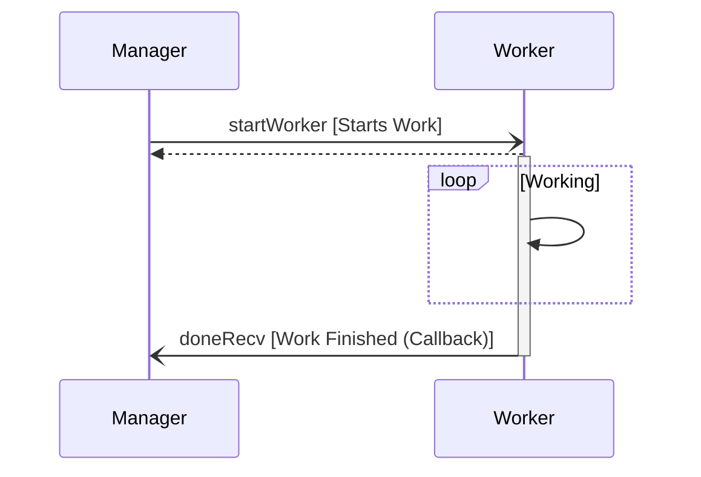

# ManagerWorker::Manager

A manager component that leverages a worker component to do work. Designed as an example of the following patterns:

| Pattern                  |
|--------------------------|
| Manager / Worker Pattern |


## Usage

The manager component is active component and is typically set to a high prority as it does not block when doing work.

```
instance manager: ManagerWorker.Manager base id 0xABCD \
    queue size Default.QUEUE_SIZE \
    stack size Default.STACK_SIZE \
    priority 80 # Fairly high priority in Linux priority space (0-99)

```

The manager component should connect to the work component as seen here:

```
connections MannagerWorker {
    manager.startWork -> worker.startWork
    manager.cancelWork -> worker.cancelWork
    worker.doneWork -> manager.doneRecv
}
```

## Requirements

| Name                       | Description                                                                                     | Validation |
|----------------------------|-------------------------------------------------------------------------------------------------|------------|
| MANAGER-WORKER-MANAGER-001 | The manager shall dispatch work using the `startWork` port in response to a `START` command.    | Unit-Test  |
| MANAGER-WORKER-MANAGER-002 | The manager shall stop active work using the `cancelWork` port in response to a `STOP` command. | Unit-Test  |
| MANAGER-WORKER-MANAGER-003 | The manager shall emit an event when `START` is received and work is in-progress.               | Unit-Test  |
| MANAGER-WORKER-MANAGER-004 | The manager shall emit an event reporting status when work is finished indicated by `doneRecv`. | Unit-Test  |
| MANAGER-WORKER-MANAGER-005 | The manager shall remain responsive while work is being performed.                              | Unit-Test  |
| MANAGER-WORKER-MANAGER-006 | The manager shall emit an event when the `START` command is issued and the worker is busy.      | Unit-Test  |


### Timing Diagram

The manager component has the following timing diagram.


