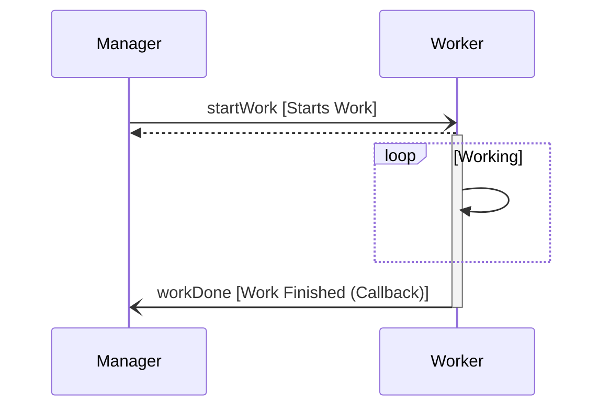

# ManagerWorker::Worker

A background worker component that performs work for a manager. Designed as an example of the following patterns:

| Pattern                  |
|--------------------------|
| Manager / Worker Pattern |
| Synchronous Cancel       |

## Usage

The worker component is active component and is typically set to a low prority as it does background work.

```
instance worker: ManagerWorker.Worker base id 0xCDEF \
    queue size Default.QUEUE_SIZE \
    stack size Default.STACK_SIZE \
    priority 20 # Fairly high priority in Linux priority space (0-99)

```

The worker component should connect to the work component as seen here:

```
connections MannagerWorker {
    manager.startWork -> worker.startWork
    manager.cancelWork -> worker.cancelWork
    worker.doneWork -> manager.doneRecv
}
```

## Requirements

| Name                       | Description                                                                          | Validation        |
|----------------------------|--------------------------------------------------------------------------------------|-------------------|
| MANAGER-WORKER-WORKER-001 | The worker shall start work in response to the  `startWork` port.                     | Unit-Test         |
| MANAGER-WORKER-WORKER-002 | The worker shall stop work in response to the `cancelWork` port.                      | Integration Test  |
| MANAGER-WORKER-WORKER-003 | The worker shall respond with the status of completed work using the `workDone` port. | Unit-Test         |


### Timing Diagram

The manager component has the following timing diagram.


